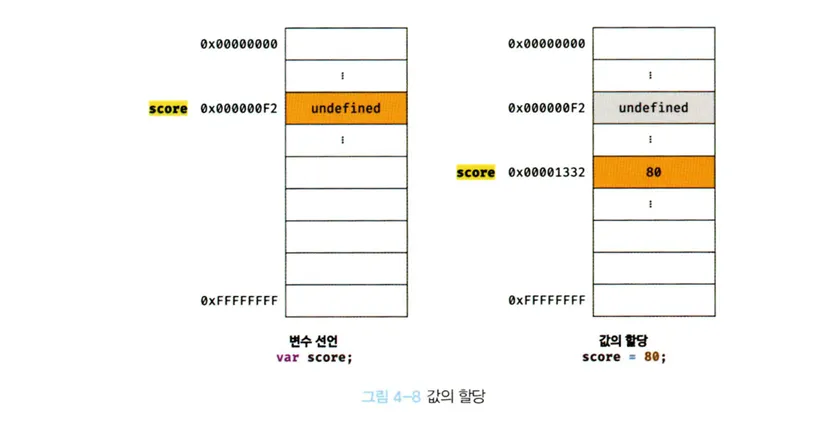

# 4.5 값의 할당

---

변수에 값을 할당할 때는 **할당 연산자(=)**를 사용, 우변의 값을 좌변의 변수에 저장한다.

```js
var score; // 변수 선언
score = 80; // 값 할당
// 또는 한줄로
var score = 80;
```

---

🗨️ **1. 실행 시점의 차이**

1. **변수 선언** : 소스코드가 순차적으로 실행되기 전인 **런타임 이전** 에 먼저 실행된다.
2. **값의 할당** : **런타임**, 즉 코드가 실제로 실행되는 시점에 이루어진다.

-> 이 차이 때문에 다음과 같은 현상이 발생한다:

- 변수는 먼저 **`undefined`로 초기화** 된다.
- 이후 런타임에 실제 값이 할당된다.

---

📚 **2. 중요한 개념**

1. 변수에 `undefined`가 먼저 할당되어 초기화되는 것은 변함이 없다.
2. **기존 메모리 공간이 수정되는 것이 아니고**, **새로운 메모리 공간이 확보** 그곳에 실제 값이 저장된다.

- 초기화 된 메모리는 그대로 두고 **새로운 값을 위한 별도의 메모리 공간을 사용**하는 것이다.

---

✅ **변수 선언과 할당 순서 변경 예시**

- 변수 선언과 값 할당의 순서를 바꿔서 작성해도 `var` 키워드는 **호이스팅**되기 때문에 다음과 같은 예시가 발생한다.


-> 메모리 공간을 지우는 것이 아니라 새로운 메모리 공간을 확보하고 그곳에 할당 값 80을 저장하는 것이다.

```js
console.log(score); // undefined

score = 80; // 값 할당
var score; // 변수 선언 (호이스팅된다)

console.log(score); // 80
```

1. 자스 엔진은 `var score;` 선언을 먼저 처리
2. 변수 `score`를 undefined로 초기화한다.
3. 이후 값 80을 할당한 상태에서 마지막 conosole.log를 실행한다.

- 구체적으로 말하면 var로 선언된 변수는 호이스팅에 의해 코드의 최상단으로 올려진다.
- 변수는 자동으로 undefined로 초기화
- 코드가 실행되고, 변수에 값을 할당 -> 80으로 할당된 상태에서 출력한다.

---
