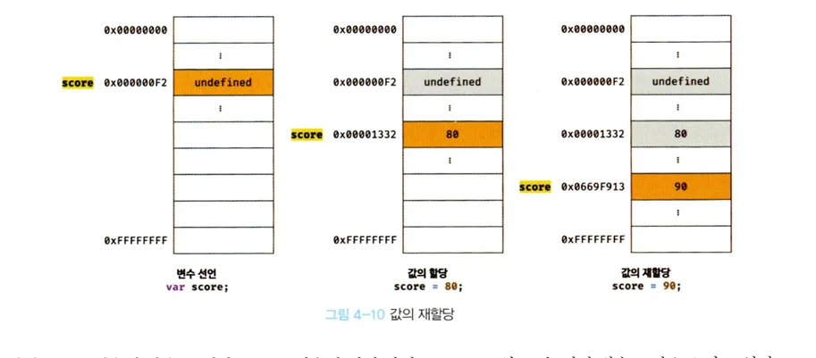
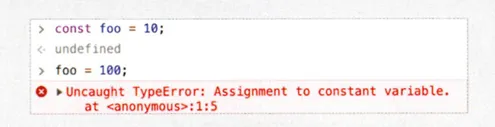

# 4.6 값의 재할당

---

score 변수에 새로운 값을 재할당한다.

```js
var score = 80; // 선언, 할당
score = 90; // 재할당
```

- var 키워드는 선언한 변수는 재할당이 가능하다.
- 기존 값은 더이상 사용할 수 없고, 새로운 값이 저장된 메모리 공간을 참조한다
- 

---

🗨️ **2. 변수와 상수의 차이**

1. **변수** : `let`, `var` -> 재할당이 가능하다.
2. **상수** : `const` -> 재할당이 불가능하다.

```js
🗨️ ES6 키워드를 사용해 선언한 변수는 재할당이 금지된다.
그러나, 반드시 상수만을 위해 사용하지는 않는다.(블록스코프 선언 된 중괄호 {} 내에세만)

```

---

📚 **3. 가비지 콜렉터란?**

- 더이상 참조되지 않는 메모리 공간을 자동으로 해제하는 기능이다.
- 가비지 콜렉터를 통해 메모리 관리를 자동화한다.

- 초기화 된 메모리는 그대로 두고 **새로운 값을 위한 별도의 메모리 공간을 사용**하는 것이다.
- 어떤 식별자도 참조하지 않아 메모리 누수를 방지한다.

---
