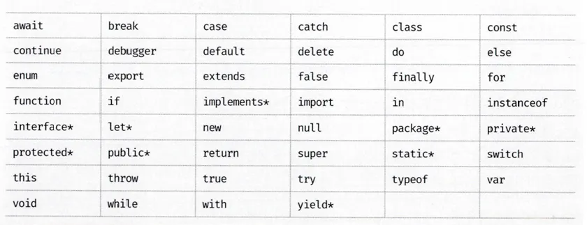

# 4.7 식별자의 네이밍 규칙

---

다음과 같은 네이밍 규칙을 준수해야 한다.

- 특수문자를 제외한 문자, 숫자, \_, 달러 기호를 포함할 수 있다.
- 문자, \_, 달러 기호로 시작해야 한다. 숫자로 시작하는 것은 안돼고, 식별자로 사용할 수 없다.

> 💡 **예약어란?**  
> 예약어는 프로그래밍 언어에서 사용되었거나, 사용할 예정인 단어이다.
> 

변수 이름도 네이밍 규칙을 따라야 한다.

```js
var person, $elem, _name, first_name, val1;
```

다음 식별자는 규칙에 위배된다.

```js
var first-name; // 하이픈이 연산자로 처리되기 때문에 발생합니다.
var 1st; // 변수명이 숫자로 시작해서 발생합니다.
var this; // this가 예약어로 처리되기 때문에 발생합니다.
```

대소문자를 구별한 각각 별개의 변수다.

```js
var firstname;
var firstName;
var FIRSTNAME;
```

존재 목적을 쉽게 이해할 수 있는 명확한 표현을 써야한다.

```js
var x = 3;
var score = 100;
```

네이밍 컨벤션은 하나 이상의 영어 단어로 구성된 식별자를 만들때 한눈에 구분하기 위해 규정한 규칙이다.

- 변수나 함수는 **카멜 케이스**
- 생성자 함수, 클래스 이름은 **파스칼 케이스**를 사용한다.

```js
// 카멜 케이스(cameCase)
var firstName;

// 스네이크 케이스(snake_case)
var first_name;

// 파스칼 케이스(PascalCase)
var FirstName;

// 헝가리언케이스(typeHungarianCase)
var strFirstName;
var $elem = document.getElementById("myid"); //DOM 노드
var observable$ = fromEvent(document, "click"); // RxJS 옵저버블
```

---
