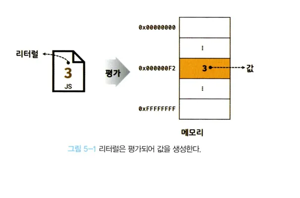

# 5.2 리터럴

---

🟢 **1. 리터럴**

- **리터럴(literal)**은 사람이 이해할 수 있는 문자 또는 약속된 기호를 사용해 값을 생성하는 표기법을 말한다.
- 3은 숫자 리터럴이다. 사람이 이해할 수 있는 아라비아 숫자를 사용해 숫자 리터럴 3을 코드에 기술하면 자스 엔진은 이를 평가해 숫자 값 3을 생성한다.
  

- 리터럴은 사람이 이해할 수 있는 문자(숫자, 알파벳, 한글 등) 또는 미리 약속된 기호(", "", ., [], {}, //) 등으로 표기한 코드이다.
- 자스 엔진은 코드가 실행되는 시점인 런타임에 리터럴을 평가해 값을 생성한다. 리터럴은 값을 생성하기 위해 미리 약속한 표기법이라고 할 수 있다.

---

다양한 종류의 값을 생성할 수 있다.

| 리터럴 종류        | 예시                                | 비고                  |
| ------------------ | ----------------------------------- | --------------------- |
| 정수 리터럴        | 100                                 |                       |
| 부동소수점 리터럴  | 10.5                                |                       |
| 2진수 리터럴       | 0b01000001                          | `0b`로 시작           |
| 8진수 리터럴       | 0o101                               | ES6 도입, `0o`로 시작 |
| 16진수 리터럴      | 0x41                                |                       |
| 문자열 리터럴      | `'Hello'`, `"World"`                |                       |
| 불리언 리터럴      | `true`, `false`                     |                       |
| null 리터럴        | `null`                              |                       |
| undefined 리터럴   | `undefined`                         |                       |
| 객체 리터럴        | `{ name: 'Kim', address: 'Seoul' }` |                       |
| 배열 리터럴        | `[1, 2, 3]`                         |                       |
| 함수 리터럴        | `function() {}`                     |                       |
| 정규 표현식 리터럴 | `/[A-Z]+/g`                         |                       |

---
