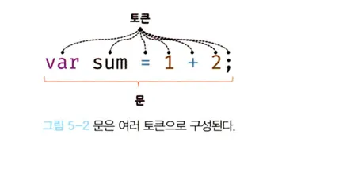

# 5.4 문

---

🗨️ **1. 문에 관해서**

- **문(statement)는 프로그램을 구성하는 기본 단위이자 최소 실행 단위다.**
- 문의 집합으로 이뤄진것이 프로그램, 문을 작성하고 순서에 맞게 나열하는 것이 프로그래밍이다.

문은 여러개의 토큰으로 구성된다.


- 토큰(token)이란 문법적으로 더 이상 나눌 수 없는 코드의 기본 요소를 의미한다.
- ex: 키워드, 식별자, 연산자, 리터럴, 세미콜론(;), 마침표 등의 특수기호는 문법적인 의미를 가진다.
- 문법적으로 더 이상 나눌 수 없는 코드의 기본요소 이므로 모두 토큰이다.

---

문은 명령문이라고 한다. 문은 컴퓨터에 내리는 명령이다.

- 문은 선언문, 할당문, 조건문, 반복문 등으로 구분할 수 있다.

```js
// 변수 선언문 -> 변수선언
var x;

// 할당문 -> 값 할당
x = 5;

// 함수 선언문
function foo() {}

// 조건문 -> 지정한 조건에 따라 코드블록({...})이 결정되어 실행
if (x > 1) {
  console.log(x);
}

// 반복문 -> 특정 코드 블록이 반복 실행된다.
for (let i = 0; i < 2; i++) {
  console.log(i);
}
```

---
