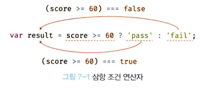

# 6.9 데이터 타입이 필요한 이유

---

## 📌 6.9.1 데이터 타입에 의한 메모리 공간의 확보와 참조

### ✅ 왜 데이터 타입이 필요할까?

- 값을 메모리에 **저장**하거나 **참조**하기 위해 **공간의 크기와 해석 방법**을 결정해야 한다.

```js
var score = 100;
```

- 자바스크립트 엔진이 숫자 타입으로 판단 8바이트 메모리 공간을 확보하고 `100`을 2진수로 저장한다.
- 숫자 타입은 배정밀도 64비트 부동소수점 형식을 사용한다.
  -> 이는 8바이트(64비트) 공간을 의미한다.

## 시각적 메모리 구조

- 숫자 타입 값 `100`이 메모리에 8바이트로 할된다.
  

---

## 💡 ECMAScript 사양 정리

- ECMAScript 사양은 **문자열, 숫자 타입 외의 타입**에 대해서는 메모리 크기를 명시하지 않음
- 하지만 **숫자 타입**은 반드시 **8바이트(64비트 부동소수점)** 로 저장되어야 한다고 명시함

---

## ✅ 값 참조 시 필요한 정보

값을 참조하려면 몇 개의 메모리 셀을 읽어야 하는지 알아야 한다.

- `score`는 숫자 타입  
  → **8바이트 단위**로 읽어야 함  
  → 그렇지 않으면 **값이 훼손**될 수 있음

---

## 📎 심벌 테이블(Symbol Table)

자바스크립트 엔진은 내부적으로 **심벌 테이블**이라는 자료 구조를 사용하여 다음 정보를 관리함:

- 변수의 이름 (식별자)
- 데이터 타입
- 메모리 주소
- 스코프

---

## 📌 6.9.2 데이터 타입에 의한 값의 해석

### ✅ 문제: 2진수를 어떻게 해석할까?

- 메모리에는 모든 값이 **2진수(비트)** 형태로 저장됨
- 해석은 **데이터 타입**에 따라 다르게 이루어짐

```txt
예) 0100 0001
- 숫자로 해석 → 65
- 문자열로 해석 → 'A'
```

score 변수는 숫자 타입으로 저장되었기 때문에
→ 메모리에서 읽은 2진수를 숫자 값으로 해석

---

### 🧾 데이터 타입이 필요한 3가지 이유 요약

1. 값을 저장할 때 -> 확보해야 할 메모리 공간의 크기를 결정
2. 값을 참조할 때 -> 한 번에 읽어 들어야할 메모리 셀 크기를 결정
3. 값을 해석할 때 -> 메모리에서 읽은 2진수 해석 방식을 결정하기 위해
