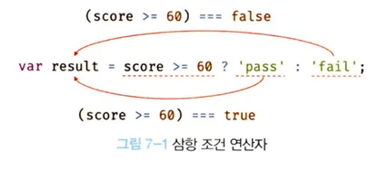

# 7.4 삼항 조건 연산자

---

- 삼항 조건 연산자는 조건식의 평가 결과에 따라 반환할 값을 결정한다.
- 삼항 조건 연산자 표현식
  -> 조건식 ? 조건식이 true 반한활 값 : 조건식 false 반한활 값
  

```JS
var foo;
console.log(foo); // undefined
```

- 삼항 조건 연산자 첫 번째 피연산자가 true로 평가
- 두번째 피연산자를 반환, 첫 번째 피연산자가 false로 평가면 세 번째 피연산자를 반환한다.
- 삼항 조건 연산자는 두 번째 피연산자 또는 세 번째 피연산자로 평가되는 표현식이다.
- ? 앞의 첫 번째 피연산자는 조건식, 불리언 타입의 값으로 평가될 표현식이다.
- 불리언 값이 아니면 불리언 값으로 암묵적 타입 변환된다.
- 조건식이 참이면 콜론 앞의 두 번째 피연산자가 평가되어 반환
- 거짓이면 콜론 뒤의 세번째 피 연산자가 평가되어 반환된다.

예제 7-21

```js
var x = 2;
// 2 % 2는 0, 0은 false로 암묵적 타입 변환
var result = x % 2 ? "홀수" : "짝수";

conosle.log(result); // 짝수
```

- 삼항 조건 연산자의 첫 번째 피연산자는 조건식
- 삼항 조건 연산자 표현식은 조건문이다.
- if ...else문과 유사하다.

예제 7-22

```js
var x = 10;

// if ...else 문은 표현식이 아닌 문이다. 따라서 값처럼 사용할 수 없다.
var result = if ( x % 2) {
  result = "홀수;
} else {
  result = "짝수";
}
// SyntaxError: Unexpected token if
```

- **삼항조건 연산자 표현식은 값으로 평가할 수 있는 표현식인 문이다.**
- 다른 표현식의 일부가 될 수 있다.

예제 7-24

```js
var x = 10;

// 삼항 조건 연산자 표현식은 표현식인 문이다. 값처럼 사용할 수 있다.
var result = x % 2 ? "홀수" : "짝수";

console.log(result); // 짝수
```
