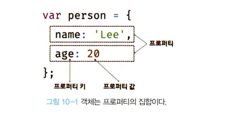
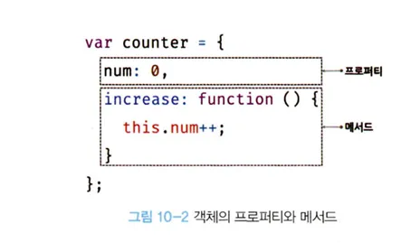

# 10.1 객체란?

---

- 자바스크립트는 객체(object) 기반의 프로그래밍 언어고, 자바스크립트를 구성하는 거의 "모든 것"이 객체다. 원시 값을 제외한 나머지 값(함수, 배열, 정규 표현식 등)은 모두 객체다.
- 원시 타입은 단 하나의 값만 나타내고 객체 타입(object / reference type)은 다양한 타입의 값(원시 값 또는 다른 객체)을 하나의 단위로 구성한 복합적인 자료(data structure)다.
- **원시 타입의 값, 즉 원시 값은 변경 불가능한 값(immutable value)이지만 객체 타입의 값, 즉 객체는 변경 가능한 값(mutable value)다.**
- 객체는 0개 이상의 프로퍼티로 구성된 집합, 프로퍼티는 키(key)와 값(value)로 구성된다.
  
- 자바스크립트에서 사용할 수 있는 모든 값은 프로퍼티 값이 될 수 있다.
- 함수는 일급 객체 이므로 값으로 취급할 수 있다.

- 프로퍼티 값이 함수일 경우 일반 함수와 구분하기 위해 메서드(method)라 부른다.
  

- 이처럼 객체는 프로퍼티와 메서드로 구성된 집합체다. 프로퍼티와 메서드의 역할은 다음과 같다.
  - 프로퍼티: 객체의 상태를 나타내는 값 (data)
  - 메서드: 프로퍼티 (상태 데이터)를 참조하고 조작할 수 있는 동작
- 객체는 상태를 나타내는 값(프로퍼티)와 프로퍼티를 참조하고 조작할 수 있는 동작(메서드)을 모두 포함하여 상태와 동작을 하나의 단위로 구조화 할 수 있어 유용하다.

### 객체와 함수

<aside>
💡 자스의 객체는 함수와 밀접한 관계를 가진다. 함수로 객체를 생성하기도 하며 함수 자체가 객체이기도 하다. 자스에서 함수와 객체는 분리해서 생각할 수 없는 개념이다. 즉, 객체를 이해해야 함수를 이해할 수 있고, 반대로 함수를 이해해야 객체를 정확히 이해할 수 있다.
</aside>

- 객체의 집합으로 프로그램을 표현하려는 프로그래밍 패러다임을 객체지향 프로그래밍이라 한다. 객체지향 프로그래밍에 대해서 추후 자세히 살펴볼 예정이다.
