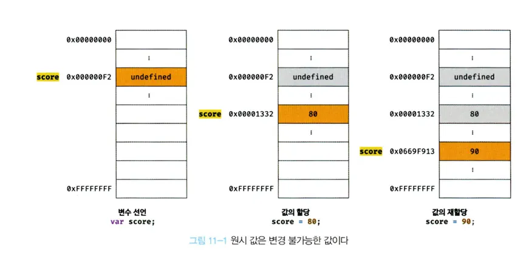
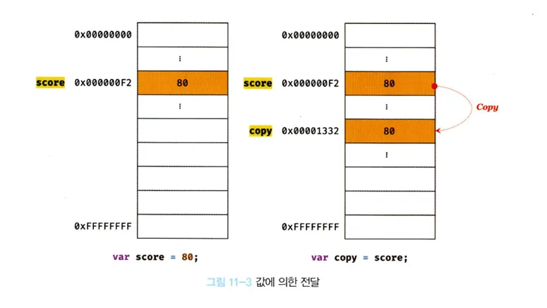
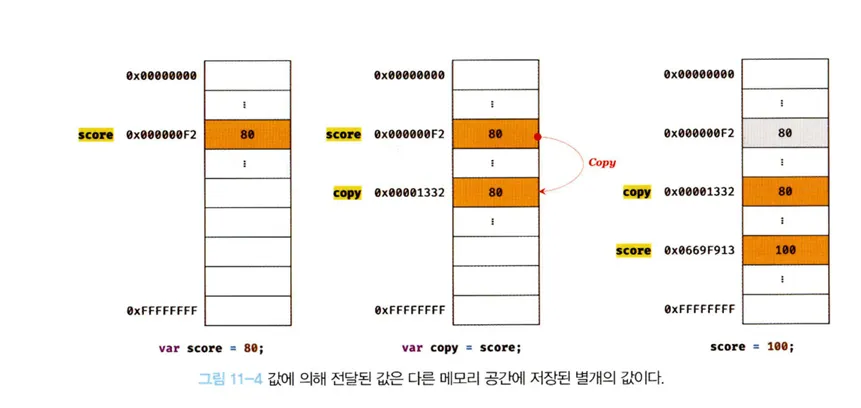

# 11.1 원시 값

---

#### 11.1.1 변경 불가능한 값

- **원시 타입(primitive type)의 값, 즉 원시 값은 변경 불가능한 값(immutable value)** 이다. 한번 생성된 원시 값은 읽기 전용(read only)값으로 변경할 수 없다.
- 변수와 값은 구분해서 생각해야 한다. 변수는 하나의 값을 저장하기 위해 확보한 메모리 공간, 또는 메모리 공간을 식별하기 위해 붙인 이름이다.
- 값은 변수에 저장된 데이터, 표현식이 평가되어 생성된 결과이다.
- **변경 불가능한 것은 값에 대한 것이다**.
- 변수는 언제든지 재할당을 통해 변수 값을 변경할 수 있다.

- 상수는 재할당이 금지된 변수를 말한다.
- 상수도 값을 저장하기 위한 메모리 공간이 필요해 변수라고 한다.
- 상수는 단한번만 할당이 허용되어 변수 값을 변경할 수 없다.

예제 11-1

```js
// const 키워드를 사용 선언한 변수는 재할당이 금지된다. 상수는 재할당이 금지된 변수다.
const o = {};

// const 키워드를 사용 선언한 변수에 할당한 원시 값 (상수)은 변경할 수 없다.
// const 키워드를 사용해 선언한 변수에 할당한 객체는 변경할 수 있다.
o.a = 1;
console.log(o); // {a: 1}
```

- 원시 값은 변경불가능한 값, 읽기 전용 값이다.
- 원시 값은 불변하여 데이터의 신뢰성을 보장한다.
- 원시 값을 할당한 변수에 새로운 원시값 재할당 -> 새로운 메모리 공간을 확보 -> 재할당 원시값 저장
- 이후 변수는 새롭게 재할당한 원시 값을 가리킨다.
- 변수가 참조하던 메모리 공간의 주소가 바뀐다.
  

- 변수에 할당된 원시 값이 변경 불가능한 값이다.
- 원시 값이 변경 가능한 값 -> 변수에 새로운 원시 값 재할당 -> 원시 값 자체 변경
- 변수가 참조하던 메모리 공간의 주소는 바뀌지 않는다.
  

- 하지만 원시 값은 변경 불가능한 값 -> 직접 값을 변경할 수 없다.
- 원시 값을 변경하기 위해 원시 값을 재할당 -> 새로운 메모리 공간 확보 -> 재할당한 값 저장 -> 변수에 참조하던 메모리 공간의 주소를 변경한다.
- 값의 특성을 **불변성**이라한다.
- **불변성을 갖는 원시 값을 할당한 변수는 재할당 이외에 변수 값을 변경할 수 있는 방법이 없다.**
- 재할당 이외에 변경할 수 있다면 값이 변경될 수 있다는 것을 의미한다.
- 값의 변경, 상태 변경을 추적하기 어렵게 한다.

---

#### 11.1.2 문자열과 불변성

- 원시메모리 공간의 크기를 결정해야 한다.
- 문자열은 독특한 특징이 있다.
- 1개의 문자는 2바이트의 메모리 공간에 저장되어 문자에 따라 필요한 메로리 공간의 크기가 결정된다.
- 1개의 문자는 2바이트, 10개의 문자는 20바이트가 필요하다.

예제 11-2

```js
// 문자열은 0개 이상의 문자로 이뤄진 집합이다.
var str1 = ""; // 0개 문자로 이뤄진 문자열
var str2 = "Hello"; // 5개의 문자로 이뤄진 문자열
```

- 자스는 원시 타입인 문자열 타입을 제공한다.
- 문자열은 원시 타입이고 변경 불가능하다.
- 문자열이 생성된 이후 변경할 수 없다.

예제 11 - 3

```js
var str = "Hello";
str = "world";
```

- 첫번째 문이 실행되면 문자열 "Hello"가 생성
- 식별자 str은 문자열 "Hello"가 저장된 메모리 공간의 첫 번째 메모리 셀 주소를 가리킨다.
- 두번째 문 실행 -> "Hello"를 수정 X, 새로운 문자열 "world"를 메모리에 생성, 식별자 str은 이것을 가리킨다.
- 문자열 "Hello", "World"는 모두 메모리에 존재한다.
- 문자열은 유사 배열 객체고 이터러블로 배열과 유사하게 각 문자에 접근할 수 있다.

**📖 유사 배열 객체**

> 💡
> **유사 배열 객체(Array-like Object)란 마치 배열처럼 인덱스로 프로퍼티 값에 접근할 수 있고 length 프로퍼티를 갖는 객체를 말한다.** > **문자열은 마치 배열처럼 인덱스를 통해 각 문자에 접근할 수 있고, length 프로퍼티를 갖기에 유사 배열 객체이고 for 문으로 순회할수도 있다.**
>
> 예제 11-4
>
> ```javascript
> var str = "string";
>
> // 문자열은 유사 배열이므로 배열과 유사하게 인덱스를 사용해 각 문자에 접근할 수 있다.
> console.log(str[0]); // s
>
> // 원시 값인 문자열이 객체로 동작한다.
> console.log(str.length); // 6
> console.log(str.toUpperCase()); // STRING
> ```
>
> 갑자기 원시 값인 문자열이 객체일 수도 있다니 혼란스러울 수 있다. 원시 값을 객체처럼 사용하면 원시 값을 감싸는 **래퍼 객체(Wrapper Object)**로 자동 변환된다.

예제 11-5

```js
var str = "string";

// 문자열은 유사 배열, 배열과 유사하게 인덱스를 사용해 각 문자에 접근할 수 있다.
// 문자열은 원시 값으로 변경할 수 없다. 이때 에러가 발생하지 않는다.
str[0] = "S";

console.log(str); // string
```

- str[0] = 'S' 이미 생성된 문자열의 일부 문자를 변경해도 반영되지 않는다.
- 문자열은 변경 불가능한 값이다.
- 한번 생성된 문자열은 읽기 전용 값으로서 변경할 수 없다.
- 원시 값은 어떤일이 있어도 불변하여 데이터의 신뢰성을 보장한다.
- 변수에 새로운 문자열을 재할당하는 것은 가능하고, 기존 문자열 변경이 아닌 새로운 문자열을 새롭게 할당하는 것이다.

-

#### 11.1.3 값에 의한 전달

예제 11-6

```js
var score = 80;
var copy = score;

console.log(score); // 80
console.log(copy); // 80

score = 100;

console.log(score); // 100
console.log(copy); // 80
```

- score 변수에 숫자 값 80을 할당한다. copy 변수에 socre 변수 할당 -> score 변수에 새로운 숫자 값 100을 재할당한다면 copy는?
- copy = score 에서 score는 80으로 평가되고 copy 변수에도 80이 할당한다. 새로운 숫자 값이 80이 생성되어 할당된다.
- 변수에 원시 값을 갖는 변수를 할당 -> 할당받는 변수에 할당되는 변수의 원시 값이 복사되어 전달.
- 이를 **값에 의한 전달**이라 한다.
- copy 변수 - 원시 값 score 변수 할당 -> 할당받는 변수 copy에 할당되는 변수 score의 원시 값 80이 복사되어 전달된다.

예제 11-7

```js
// copy 변수에 score 변수의 값 80이 복사되어 할당된다.
var copy = score;

console.log(score, copy); // 80 80
console.log(score === copy); // true
```

- score 변수와 copy 변수는 80을 갖는다는 점에서 동일하다.
- 하지만 score 변수와 copy변수의 값은 다른 메모리 공간에 저장된 별개의 값이다.
  

- score 변수의 값을 변경해보자
  예제 11-8

```js
var score = 80;

// copy 변수에는 score 변수의 값이 80이 복사되어 할당된다.
var copy = score;

console.log(score, copy); // 80 80
console.log(score === copy); // true

// score 변수와 copy 변수의 값은 다른 메모리 공간에 저장된 별개의 값이다.
// 따라서 score 변수의 값을 변경해도 copy 변수의 값에는 어떠한 영향도 주지 않는다.
score = 100;

console.log(score, copy); //100 80
console.log(score === copy); // false
```

- score 변수, copy 변수의 값 80은 다른 메모리 공간에 저장된 별개의 값이다.
- 변수 score 변수의 값을 변경해도 copy 변수에 영향을 주지 않는다.
  

- 위 그림에서 변수에 원시 값을 갖는 변수를 할당 -> 원시 값이 복사되는 것으로 표현
- 하지만, 변수에 원시 값을 갖는 변수를 할당하는 시점에 두 변수가 같은 원시 값을 참조하다가 한쪽의 변수에 재할당이 이뤄질 때 새로운 메모리 공간에 재할당된 값을 저장하도록 동작할 수 있다.
- 변수에는 값 전달 X / 메모리 주소가 전달
- 변수와 같은 식별자는 값이 아니라 메모리 주소를 기억하고 있다.
- 식별자는 어떤 값을 구별해서 식별할 수 있는 고유한 이름이다.
- 값은 메모리 공간에 저장, 변수와 같은 식별자는 값이 아니라 메모리 주소를 기억한다.
- 식별자는 메모리 주소에 붙인 이름이라고 볼 수 있다.

예제 11-9

```js
var x = 10;
```

- 할당 연산자는 숫자 값 10이 저장된 메모리 공간의 주소를 전달한다.
- 식별자 x는 메모리 공간에 저장된 값 10을 식별한다.

예제 11-10

```js
var copy = score;
```

- score는 식별자 표현식으로 80으로 평가된다.
  1. 새로운 80을 생성(복사)해서 메모리 주소를 전달한다. 할당 시점에 두 변수가 기억하는 메모리 주소가 다르다.
  2. socre 변수값 80의 메모리 주소를 그대로 전달한다. 할당 시점에 두 변수가 기억하는 메모리 주소가 같다.

**"값에 의한 전달""도 메모리 주소를 전달한다. 단, 전달된 메모리 주소를 통해 메모리 공간에 접근하면 값을 참조할 수 있다**
변수 할당 시점이든, 두 변수의 원시값은 서로 다른 메모리 공간에 저장된 별개의 값이 되어 재할당을 통해 값을 변경해도 서로 간섭할 수 없다.
