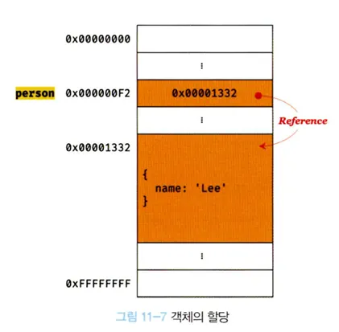
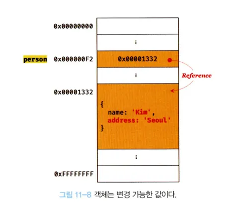
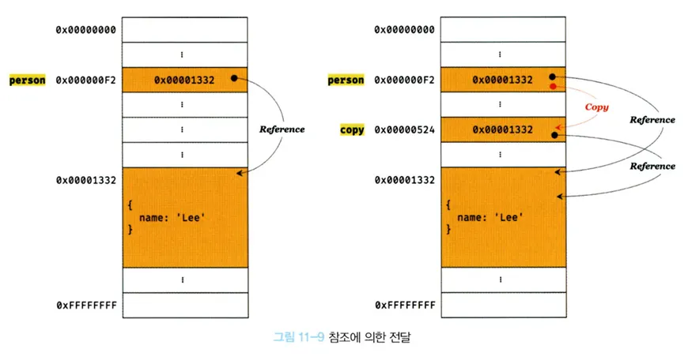

# 11.2 객체

---

- 객체는 프로퍼티의 개수가 정해져 있지 않고, 동적으로 추가되고 삭제할 수 있다.
- 원시 값과 같이 확보해야 할 메모리 공간의 크기를 사전에 정해 둘 수 없다.
- 복합적인 자료구조로 객체를 관리하는 방식이 원시 값과 비교해서 복잡하고 구현 방식도 브라우저마다 다를 수 있다.
- 경우에 따라 크기가 매우 클수도 있다.
- 원시 값과는 다른 방식으로 동작하도록 설계되어있다.

**자바스크립트 객체의 관리 방식**

> 💡
> 자바스크립트 객체는 프로퍼티 키를 인덱스로 사용하는 **해시 테이블(연관 배열, map, dictionary, lookup table이라 부르기도 함)**라고 생각할 수 있다.
> 대부분의 자스 엔진은 해시 테이블과 유사하나 높은 성능을 위해 일반적인 해시 테이블보다 나은 방법으로 객체를 구현한다.
> 자바스크립트는 클래스 없이 객체를 생성할 수 있고 객체가 생성된 이후라도 동적으로 프로퍼티와 메서드를 추가할 수 있다.
> 사용하기 매우 편리하지만 성능면에서 이론적으로 클래스 기반 객체지향 프로그래밍 언어의 객체보다 생성과 프로퍼티 접근에 비용이 더 많이 드는 비효율적인 방식이다.
> V8 엔진에서 프로퍼티에 접근하기 위해 동적 탐색 대신 히든 클래스라는 방식을 사용해 C++ 객체의 프로퍼티에 접근하는 정도의 성능을 보장한다.

---

#### 11.2.1 변경 가능한 값

- **객체(참조) 타입의 값, 객체는 변경 가능한 값이다. 변수에 객체를 할당한다.**
  예제 11-11

```js
var person = {
  name: "Kim",
};
```

- 원시 값을 할당한 변수가 기억하는 메모리 주소를 통해 메모리 공간에 접근하면 원시 값에 접근할 수 있다.
- 원시 값을 할당한 변수는 원시 값 자체를 값으로 갖는다.
- 객체를 할당한 변수가 기억하는 메모리 주소를 통해 메모리 공간에 접근하면 참조 값(reference value)에 접근할 수 있다.
- 참조 값은 생성된 객체가 저장된 메모리공간 그 자체다.
- 변수에는 생성된 객체가 실제로 저장된 메모리 공간의 주소가 저장되어 있다. 이 값을 참조값이라고 한다.
- 변수는 이 참조 값을 통해 객체에 접근할 수 있다.
  

- 원시 값을 할당한 변수를 참조하면 메모리에 저장되어 있는 원시 값에 접근한다.
- 객체를 할당한 변수를 참조 -> 메모리에 저장되어 있는 참조 값을 통해 실제 객체에 접근한다.

예제 11-12

```js
// 할당이 이뤄지는 시점에 객체 리터럴이 해석되고, 결과 객체가 생성된다.
var person = {
  name: "Kim",
};

// person 변수에 저장되어 있는 참조 값으로 실제 객체에 접근한다.
console.log(person); // {name: "Kim"}
```

- 원시 값을 할당한 변수는 변수는 00 값을 갖는다 혹은 값은 00다. 라고 표현한다.
- 객체를 할당한 변수의 경우 -> 변수는 객체를 참조하고 있다, 변수는 객체를 가리키고 있다 라고 표현한다.
- person변수는 객체 {name: 'Kim'}을 가리키고 있다(참조)
- **원시 값은 변경 불가능한 값, 원시 값을 갖는 변수의 값을 변경하려면 재할당 외에는 방법이 없다.**
- **객체는 변경 가능한 값이다. 따라서 객체를 할당한 변수는 재할당 없이 객체를 직접 변경할 수 있다. 재할당 없이 프로퍼티를 동적으로 추가할 수 있고 프로퍼티 값을 갱신할 수 있고 프로퍼티 자체를 삭제할 수도 있다**

예제 11-13

```js
var person = {
  name: "Kim",
};

// 프로퍼티 값 갱신
person.anme = "Lee";

// 프로퍼티 동적 생성
person.address = "Seoul";

console.log(person); // {name: "Lee", address: "Seoul" }
```

- 원시 값은 변경 불가능한 값 -> 원시 값을 갖는 변수의 값을 변경하려면 재할당을 통해 메모리에 원시 값을 새롭게 생성해야 한다.
- 객체는 변경 가능한 값이므로 메모리에 저장된 객체를 직접 수정할 수 있다.
- 객체를 할당한 변수에 재할당을 하지 않았어서 객체를 할당한 변수의 참조 값은 변경되지 않는다.
  

- 객체를 생성하고 관리하는 방식이 매우 복잡하고 비용이 많이 든다.
- 메몰리를 효율적으로 사용하기 위해, 객체를 복사해 생성하는 비용을 절약해 성능을 향상시키기 위해 객체는 변경 가능한 값으로 설계되어 있다.
- **여러 개의 식별자가 하나의 객체를 공유할 수 있다**는 부작용도 있다.

> 💡 ##얕은 복사와 깊은 복사
>
> 객체를 프로퍼티 값으로 갖는 객체의 경우 **얕은 복사**는 한 단계까지만 복사하는 것을 말하고 **깊은 복사**는 객첻에 중첩되어있는 객체까지 모두 복사하는 것을 말한다.
>
> ### 예제 11-14
>
> ```javascript
> const o = { x: { y: 1 } };
>
> // 얕은 복사
> const c1 = { ...o }; // 스프레드 문법
> console.log(c1 === o); // false (c1과 o는 다른 객체)
> console.log(c1.x === o.x); // true (c1.x와 o.x는 같은 객체를 참조)
>
> // lodash 의 cloneDeep을 사용한 깊은 복사
> // "npm install lodash"로 lodash를 설치한 후, Node.js 환경에서 실행
> const _ = require("lodash");
>
> // 깊은 복사
> const c2 = _.cloneDeep(o);
> console.log(c2 === o); // false (c2와 o는 다른 객체)
> console.log(c2.x === o.x); // false (c2.x와 o.x는 완전히 분리된 다른 객체)
> ```
>
> 얕은 복사와 깊은 복사로 생성된 객체는 원본과는 다른 객체다. 즉, 원본과 복사본은 참조 값이 다른 별개의 객체다.
>
> 하지만 얕은 복사는 객체에 중첩되어 있는 객체의 경우 **참조 값을 복사**하고, 깊은 복사는 객체에 중첩되어 있는 객체까지 모두 복사해서 **원시 값처럼 완전한 복사본**을 만든다는 차이가 있다.
>
> ---
>
> **[참고]**
>
> 다음과 같이 원시 값을 할당한 변수를 다른 변수에 할당하는 것을 **깊은 복사**(값이 복사됨), 객체를 할당한 변수를 다른 변수에 할당하는 것을 **얕은 복사**(참조 값이 복사됨)라고 부르기도 한다.
>
> ### 예제 11-15
>
> ```javascript
> const v = 1;
>
> // "깊은 복사"라고 부른다. (원시 값은 값 자체가 복사됨)
> const c1 = v;
> console.log(c1 === v); // true
>
> const o = { x: 1 };
>
> // "얕은 복사"라고 부르기도 한다. (객체는 참조 값(주소)이 복사됨)
> const c2 = o;
> console.log(c2 === o); // true
> ```

#### 11.2.2 참조에 의한 전달

- 여러 개의 식별자가 하나의 객체를 공유할 수 있다는 것의 의미와 생기는 부작용을 확인한다.

예제 11-16

```js
var person = {
  name: "Kim",
};

// 참조 값을 복사 (얕은 복사)
var copy = person;
```

- 객체를 가르키는 변수(원본, person)을 다른 변수(사본, copy)에 할당하면 원본의 **참조 값이 복사되어 전달**된다. 이를 **참조에 의한 전달**이라한다.

  

- 위 그럼처럼 원본 person을 사본 copy에 할당, 원본 person의 참조 값을 복사해 copy에 저장한다.
- 원본 person과 사본 copy는 저장된 메무리 주소는 다르나 동일한 참조값을 갖는다.
- 원본 person과 사본 copy 모두 동일한 객체를 가르킨다.
- **두개의 식별자가 하나의 객체를 공유**한다는 것을 의미한다.
- 원본 or 사본 중 한쪽에서 객체를 변경하면 서로 영향을 주고 받는다.

예제 11-17

```js
var person = {
  name: "kim",
};

// 참조 값을 복사(얕은 복사), copy와 person은 동일한 참조 값을 갖는다.
var copy = person;

// copy와 person은 동일한 객체를 참조한다.
console.log(copy === person); // true

// copy를 통해 객체를 변경한다.
copy.name = "kim";

// person를 통해 객체를 변경한다.
person.address = "Seoul";

// copy와 person은 동일한 객체를 가르킨다.
// 따라서 어느 한쪽에서 객체를 변경하면 서로 영향을 주고 받는다.
console.log(person); // {name: "Kim", address: "Seoul"}
console.log(copy); // {name: "Kim", address: "Seoul"}
```

- **"값에 의한 전달"과 "참조에 의한 전달"은 식별자가 기억하는 메모리 공간에 저장되어 있는 값을 복사해서 전달한다는 면에서 동일하다**
- 다만 식별자가 기억하는 메모리 공간, 변수에 저장되어 있는 값이 원시 값이냐 참조 값이냐의 차이만 있을 뿐이다.
- 따라서 자스에는 **"참조에 의한 전달"**은 존재하지 않고 **"값에 의한 전달"**이 존재한다고 본다.

예제 11-18

```js
var person1 = {
  name: "Kim",
};

var person2 = {
  name: "Kim",
};

console.log(person1 === person2); // false
console.log(person1.name === person2.name); // true
```

- person1 변수와 person2 변수가 가리키는 객체는 내용은 같으나 다른 메모리에 저장된 별개의 객체다.
