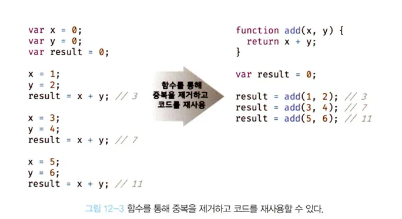

# 12.2 함수를 사용하는 이유

---

- 함수는 필요할 때 여러 번 호출할 수 있다.
- 실행 시점을 개발자가 결정하고 몇번이든 재사용이 가능하다.
- 동일한 작업을 반복적으로 수행해야 하면 같은 코드를 중복해서 여러 번 작성하는 것이 아닌 미리 정의도니 함수를 재사용하는 것이 효율적이다.
- **함수는 몇번이든 호출할 수 있어 코드의 재사용**이라는 측면에서 매우 유용하다.

  

- 코드의 중복을 억제하고 재사용성을 높이는 함수는 **유지보수의 편의성을 높이고 실수를 줄여 코드의 신뢰성을 높이는 효과**가 있다.
- 함수는 **객체타입의 값**이다.
- 식별자(이름)을 붙일 수 있다. 함수 이름은 변수 이름과 마찬가지로 함수 자신의 역할을 설명해야 한다.
- **적절한 함수 이름은 함수의 내부 코드를 안봐도 함수의 역할을 파악할 수 있다. -> 코드의 가독성을 향상 시킨다.**
