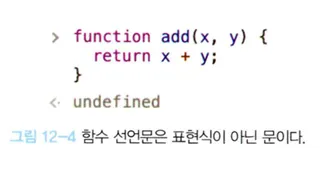
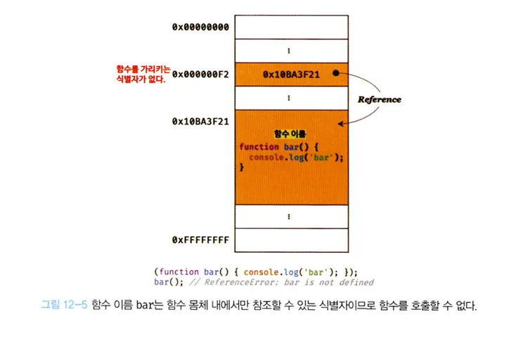
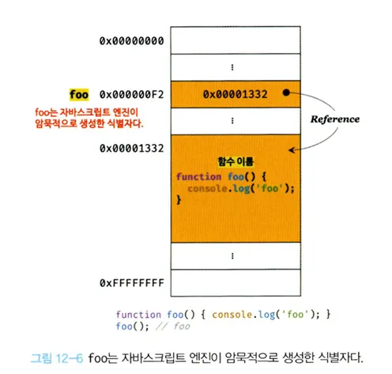
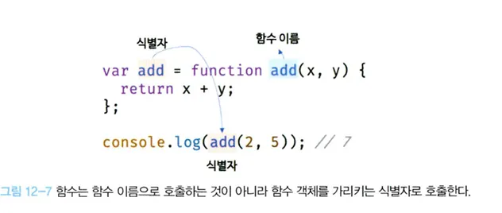

# 12.4 함수 정의

- 함수 정의란 함수를 호출하기 이전 인수를 전달받을 매개변수와 실행할 문, 반환할 값을 지정하는것을 말한다.

| 함수 정의 방식 | 예시                 |
| -------------- | -------------------- |
| 함수 선언문    | function add(x, y) { |

return x + y;
}; |
| 함수 표현식 | var add = function (x, y) {
return x + y;
}; |
| Fucntion 생성자 함수 | var add = new Function(’x’, ‘y’, ‘return x + y’); |
| 화살표 함수(ES6) | var add = (x, y) ⇒ x + y; |

- 변수 선언과 함수 정의
  > 💡
  > 변수는 선언헌다고 하지만 함수는 정의한다고 표현한다. 함수 선언문이 평가되면 식별자가 암묵적으로 생성되고 함수 객체가 할당된다.
  > 변수에는 선언, 함수에는 정의라고 표현한다.

---

#### 12.4.1 함수 선언문

예제 12-5

```js
// 함수 선언문
function aded(x, y) {
  return x + y;
}

// 함수 참조
// console.dir은 console.log와 달리 함수 객체의 프로퍼티까지 출력한다.
// Node.js 환경에서는 console.log와 같은 결과가 출력된다./
console.dir(add); // f add(x, y)

// 함수 호출
console.log(add(2, 5)); // 7
```

- 함수 선언문은 리터럴과 형태가 동일하다.
- 함수 리터럴은 함수 이름을 생략 가능, **함수 선언문은 이름을 생략할 수 없다.**

예제 12-6

```js
// 함수 선언문은 이름을 생략할 수 없다.
function (x, y) {
  return x + y;
}
// SyntaxError: Function statements require a function name
```

- **함수 선언문은 표현식이 아닌 문이다.**
- 개발자 도구의 콘솔에서 함수 선언문을 실행하면 완료 값 undefined가 출력된다.
- 선언문이 만약 표현식인 문이면 완료 값 undefined대신 표현식이 평가되어 생성한 함수가 출력되어야 한다.
  
- 함수 선언문도 표현식이 아닌 문이므로 변수에 할당 할 수 없다.

예제 12-7

```js
// 함수 선언문은 표현식이 아닌 문이므로 변수에 할당할 수 없다.
// 하지만 함수 선언문이 변수에 할당되는 것처럼 보인다.
var add = function add(x, y) {
  return x + y;
};

// 함수 호출
console.log(add(2, 5)); // 7
```

- 자바스크립트 엔진이 코드의 문맥에 따라 동일한 함수 리터럴을 표현식이 아닌 문인 함수 선언문으로 해석하는 경우와 표현식인 문인 함수 리터럴 표션기으로 해석하눈 경우가 있따.
- 함수 선언문은 함수 이름을 생략할 수 없다는 걸 제외하곤 함수 리터럴고 형태가 동일하다.
- {}은 블록문일수 있고 객체 리터럴 일 수도 있다. {}은 중의적 표현이다.
- 자바스크립트 엔진은 중의적인 코드는 코드의 문맥에 따라 해석이 달라진다.
- {} 단독으로 존재하면 자바스크립트 엔진은 {}을 블록문으로 해석한다.
- {}값으로 평가되어야할 문맥에서 피연산자로 사용되면 자바스크립트 엔진은 {}을 객체 리터럴로 해석한다.
- 함수 리터럴도 중의적인 코드다. 자바스크립트 엔진은 함수 이름이 있는 함수 리터럴을 단독으로 사용(값으로 평가되는 문맥에서 함수 리터럴을 사용하지 않는 경우, 함수 리터럴을 피연산자로 사용하지 않는 경우)하면 함수 선언문으로 해석한다.
- 함수 리터럴이 값으로 평가되어야 하는 문맥, 함수 리터럴을 변수에 할당이나 피연산자로 사용하여 함수 리터럴 표현식을 해석한다.
- 함수 선언문이든 리터럴 표현식이든 함수가 생성되는것은 동일하다.
- 함수를 생성하는 내부 동작에 차이가 있다.

예제 12-8

```js
// 기명 함수 리터럴을 단독으로 사용하면 함수 선언문으로 해석된다.
// 함수 선언문에서는 함수 이름을 생략할 수 없다.
function foo() {
  console.log("foo");
}
foo(); // foo

// 함수 리터럴을 피연산자로 사용하면 함수 선언문이 아니라 함수 리터럴 표현식으로 해석한다.
// 함수 리터럴에서는 함수이름을 생략할 수 있다.
(function bar() {
  console.log("bar");
});
bar(); // ReerenceError: bar is not defined
```

- 단독으로 사용된 함수 리터럴(foo)은 함수 선언문으로 해석된다.
- ()내에 있는 함수 리터럴(bar)은 함수 선언문으로 해석되지 않고 리터럴 표현식으로 해석된다.
- 그룹 피연산자의 피연산자는 값으로 평가 될 수 있는 표현식이어야 한다.
- 표현식이 아닌 문인 함수 선언문은 피연산자로 사용할 수 없다.

- 이름이 있는 기명 함수 리터럴은 코드의 문맥에 따라 함수 선언문 또는 함수 리터럴 표현식으로 해석한다.
- 함수 선언문과 함수 리터럴 표현식은 함수 객체를 생성한다는 점에서 동일하나 호출에 차이가 있다.
- 함수 선언문은 생성된 foo는 호출할 수 있으나 함수 리터럴 표현식으로 생성된 bar는 호출할 수 없다.
- 함수 이름은 함수 몸체 내에서만 참조할 수 있는 식별자다.
- 함수 몸체 외부에서 함수 이름으로 함수를 참조할 수 없어 함수 몸체 외부에 함수 이름으로 함수를 호출할 수 없다는 의미다.
- **함수를 가리키는 식별자가 없다는 것과 마찬가지다.** bar 함수는 호출할 수 없다.

  

- 함수 선언문으로 정의된 함수는 foo라는 이름으로 호출할 수 있었다.
- **foo는 함수 몸체 내부에서 유효한 식별자인 함수 이름**으로 foo로 함수를 호출할 수 없어야 한다.
- **foo는 자바스크립트 엔진이 암묵적으로 생성한 식별자다**.

  

- 자바스크립트 엔진은 함수 선언문을 해석해 함수 객체를 생성한다.
- 함수 이름은 몸체 내부에서만 유효한 식별자 -> 이름과는 별도로 생성된 객체를 가리키는 식별자가 필요하다.
- 함수를 가리키는 식별자가 없으면 생성된 함수 객체를 참조 할 수 없고 호출할 수도 없다.
- **자바스크립트 엔진은 생성된 함수를 호출하기 위해 함수 이름과 동일한 이름의 식별자를 암묵적으로 생성, 함수 객체를 할당한다.**

예제 12-9

```js
var add = function add(x, y) {
  return x + y;
};

console.log(add(2, 5)); // 7
```

- **함수는 함수 이름으로 호출하는 것이 아닌 함수 객체를 가리키는 식별자로 호출한다.**
- 함수 선언문으로 생성한 함수를 호출하는 것은 함수 이름 add가 아니라 자바스크립트 엔진이 암묵적으로 생성한 식별자 add 인것이다.
- 함수 이름과 변수 이름이 일치하여 함수 이름으로 호출된 듯 하지만 사실은 식별자로 호출된 것이다.
  
- 함수 표현식을 볼 예정이다. 함수 선언문을 함수 표현식으로 변환해 함수 객체를 생성한다고 생각할 수 있으나 동일하게 동작하는 것은 아니다.

---

#### 12.4.2 함수 표현식

- 자바스크립트의 함수는 객체 타입의 값이다. 값처럼 변수에 할당할 수 도 있고 프로퍼티 값이 될 수도 있고 배열의 요소가 될수도 있다.
- **값의 성질을 갖는 객체를 일급 객체라 한다.**
- **자바스크립트의 함수는 일급 객체다.**
- 함수는 일급객체로 함수 리터럴로 생성한 함수 객체를 변수에 할당할 수 있다
- 함수 정의 방식을 함수 표현식이라 한다. add 함수를 함수 표현식으로 바꿔서 정의하면 다음과 같다.

예제 12-10

```js
// 함수 표현식
var add = function (x, y) {
  return x + y;
};

console.log(add(2, 5)); // 7
```

- 함수 리터럴의 이름은 생략할 수 있다. 이런 함수를 익명함수라 한다. 함수 표현식 리터럴은 함수 이름을 생략하는 것이 일반적이다.
- 함수 선언문에서 호출할 때는 함수 객체를 가리키는 식별자를 사용해야 한다.
- 몸체 내부에서만 유효한 식별자, 함수 이름으로 함수를 호출할 수 없다.

예제 12-11

```js
//  기명 함수 표현식
var add = function foo(x, y) {
  return x + y;
};

// 함수 객체를 가리키는 식별자
console.log(add(2, 5)); // 7

// 함수 이름을 호출하면 ReferenceErrorr 가 발생한다
// 함수 이름은 함수 몸체 내부에서만 유효햔 식별자ㅏ다.
console.log(foo(2, 5)); // ReferenceError: foo is not defined
```

- 자바스크립트 엔진은 함수 선언문의 함수 이름을 식별자를 생성, 생성된 함수 객체를 할당하여 함수 표현식과 유사하게 동작하는 것처럼 보인다.
- 선언문과 함수 표현식은 정확히 동일하게 동작하지 않는다.
- 선언문은 표현식이 아닌 문, 표현식은 표현식인 문이다.

---

#### 12.4.3 함수 생성 시점과 함수 호이스팅

예제 12-12

```js
// 함수 참조
console.dir(add); // f add(x, y)
console.dir(sub); // undefined

// 함수 호출
console.log(add(x, y));
console.log(sub(2, 5));


// 함수 선언문
function add(x, y) {
  return x + y;
}

// 함수 표현식
var sub = function (x, y) {
  return x - y;
};

---

---

#### 12.4.4 Function 생성자 함수

---

#### 12.4.5 화살표 함수
```
