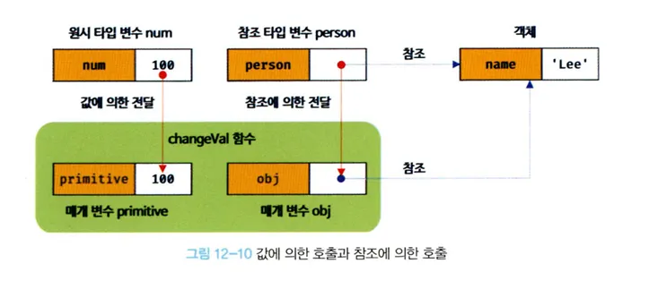

# 12.6 참조에 의한 전달과 외부 상태의 변경

---

- 원시 값은 값에 의한 전달, 객체는 참조에 의한 전달 방식으로 동작한다.
- 매개변수도 함수 몸체 내부에서 변수와 동일하게 취급, 매개변수 또한 타입에 따라 값에 의한 전달, 참조에 의한 전달 방식을 따른다.
- 함수를 호출하면 매개변수에 값을 전달하는 방식을 값에 의한 호출, 참조에 의한 호출로 구별하나 동작 방식은 동일하다.

> 💡
> *원시 값은 **값 자체가 복사**되어 전달,
> *객체와 같은 참조형은 **참조 값(주소)이 전달**된다.

예제 12-33

```js
// 매개변수 primitive는 원시 값을 전달, 매개변수 obj
function changeVal(primitive, obj) {
  primitive += 100;
  obj.name = "Kim";
}

// 외부상태
var num = 100;
var person = { name: "kim" };

console.log(num); // 100
console.log(person); // {name: "kim"}

// 원시 값은 값 자체가 복사되어 전달, 객체는 참조값이 복사되어 전달
changeVal(num, person);

// 원시 값은 원본이 훼손되지 않는다.
console.log(num); // 100

// 객체는 원본이 훼솓된다.
console.log(person); // { name: "kim"}
```

- changeVal 함수는 매개변수를 통해 전달받은 원시 타입 인수, 객체 타입 인수를 함수 몸체에서 변경한다.
- 원시 타입 인수를 전달받은 매개변수 primitive의 경우, 원시 값은 변경 불가능한 값으로 직접 변경할 수 없어 재할당을 통해 할당된 원시 값을 새로운 원시 값으로 교체
- 객체 타입 인수를 전달받은 매개변수 obj의 경우 객체는 변경 가능한 값, 직접 변경할 수 있어 재할당 없이 직접 할당된 객체를 변경한다.

- 원시 타입 인수는 값 자체가 복사, 매개변수에 전달하여 함수 몸체에서 그 값을 변경(재할당을 통한 교체)에도 원본은 훼손되지 않는다.
- 외부상태, 즉 함수 외부에서 함수 몸체 내부로 전달한 원시 값의 원본을 변경하는 어떠한 효과도 발생하지 않는다.

- 객체 타입 인수는 참조 값이 복사되어 매개변수에 전달되어 함수 몸체에서 참조 값을 통해 객체를 변경할 경우 원본이 훼손된다.
- 외부상태 함수 몸체 내부로 전달한 참조값에 의해 원본 객체가 변경되는 효과가 발생한다.

  

- 이처럼 함수가 외부 상태(객체를 할당한 person 변수)를 변경하면 상태 변화를 추적하기 어렵다.
- 객체가 변경할 수 있는 값, 참조에 의한 전달 방식으로 동작하여 발생하는 부작용이다.
- 여러 변수가 참조에 의한 전달 방식을 통해 참조 값을 공유, 변수들은 언제든지 참조하고 있는 객체를 직접 변경할 수 있다.
- 객체의 변경을 추적하려면 옵저버 패턴 등을 통해 객체를 참조를 공유하는 모든 이들에게 변경 사실을 통지, 대처하는 추가 대응이 필요하다.

- 객체를 불변 객체로 만들어 사용하는 방법이 있다.
- 객체의 복사본을 새롭게 생성하는 비용이 들고 객체를 마치 원시값처럼 변경 불가능한 값으로 동작하게 만드는 것이다.

- 객체의 상태 변경을 원천봉쇄, 객체의 상태 변경이 필요한 경우에 객체의 방어적 복사를 통해 원본 객체를 완전히 복제, 즉 깊은 복사를 통해 새로운 객체를 생성 및 재할당을 통해 교체한다.
- 외부 상태가 변경되는 부수 효과를 없앨 수 있다.

- 외부 상태를 변경하지 않고 외부 상태에 의존하지 않는 함수를 순수함수라 한다.
- 순수 함수를 통해 오류를 피하고 프로그램의 안전성을 높이려는 프로그래밍 패러다임을 함수형 프로그래밍이라 한다.

> 💡
>
> ## 🔔 깊은 복사 (MDN)
>
> 객체의 **깊은 복사(Depp Copy)**는 복사본의 속성이 복사본이 만들어진 원본 객체와 **같은 참조(메모리 내의 같은 값)을 공유하지 않는** 복사본이다. 따라서 한 객체를 변경해도 다른 객체가 변경되지 않는 것을 보장할 수 있다.
>
> 이는 원본이나 복사본의 중첩된 속성을 변경, 다른 객체도 변경될 수 있는 **얕은 복사(Shallow Copy)**의 동작과 대조적이다.
>
> ---
>
> ### 깊은 복사를 만드는 방법
>
> `JSON.stringify()`를 사용 객체를 JSON 문자열로 변환한 다음, `JSON.parse()`로 문자열을 다시 (완전히 새로운) JavaScript 객체로 변환하는 것이다.
>
> ```javascript
> const newObj = JSON.parse(JSON.stringify(originalObj));
> ```
