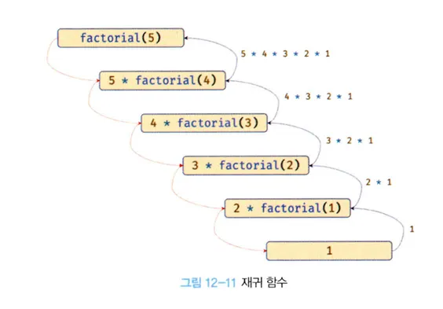

# 12.7 다양한 함수의 형태

---

#### 12.7.1 즉시 실행 함수

- 함수 정의와 동시에 즉시 호출되는 ㅈ함수를 즉시 실행 함수라 한다.
- 즉시 실행 함수는 한번만 호출되고 다시 호출할 수 없다.

예제 12-34

```js
// 익명 즉시 실행 함수
(function () {
  var a = 3;
  var b = 5;
  return a * b;
})();
```

- 즉시 실행 함수는 이름이 없는 익명함수를 사용하는 것이 일반적이다.
- 함수 이름이 있는 기명 즉시 실행 함수도 사용할 수 있다.
- 그룹 연산자 (...) 내의 기명 함수는 함수 선언문이 아니라 함수 리터럴로 평가
- 함수 이름은 함수 몸체에서만 참조할 수 있는 식별자, 즉시 실행 함수를 다시 호출할 수 없다.

예제 12-35

```js
// 기명 즉시 실행 함수
(function foo() {
  var a = 3;
  var b = 5;
  return a * b;
})();

foo(); // ReferenceError
```

- 즉시 실행 함수는 그룹 연산자 (...)로 감싸야 한다. 그렇지 않으면 다음과 같이 에러가 발생한다.

예제 12-36

```js
function () { // SyntaxError: Function statmenet
  // ...
}();
```

- 에러가 발생하는 이유는 함수 정의가 함수 선언문의 형시에 맞지 않기 때문이다.
- 함수 선언문은 이름을 생략할 수 없다.

예제 12-37

```js
function foo() {
  // ..
}(); // SyntaxError: Unexpected token ')'
```

- 자바스크립트 엔진이 암묵적으로 수행하는 세미콜론 자동 삽입 기능에 의해 함수 선언문이 끝나는 위치, 함수 코드 블록의 닫는 중괄호 뒤에 ";"이 암묵적으로 추가되기 때문

예제 12-38

```js
funciton foo() {}(); // => function foo () {}; ();
```

- 다라서 함수 선언문 뒤의 (...)는 함수 호출 연산자가 아닌 그룹 연산자로 해석된다.
- 그룹 연산자에 피연산자가 없기에 에러가 발생한다.

예제 12-39

```js
(); // Unexpected oken ')'
```

- 그룹 연산자의 피연산자는 값으로 평가, 기명 또는 무명 함수를 그룹 연산자로 감싸고 함수 리터럴로 평가하여 함수 객체가 된다.

예제 12-40

```js
console.log(typeof function f() {}); // function
console.log(typeof function () {}); // function
```

- 그룹 연산자로 함수를 묶은 이유는 함수 리터럴을 평가해서 함수 객체를 생성하기 위해서다.
- 함수 리터럴을 평가해서 함수 객체를 생성하면 그룹 연산자 이외의 연산자를 사용해도 좋다.

예제 12-41

```js
(function () {
  // ...
})();

(function () {
  // ...
})();

!(function () {
  // ...
})();

+(function () {
  // ...
})();
```

- 즉시 실행 함수도 일반 함수처럼 값을 반환할 수 있고 인수를 전달할 수 있다.

예제 12-42

```js
// 즉시 실행 함수도 일반 함수처럼 값을 반환할 수 있다.
var res = (function () {
  var a = 3;
  var b = 5;
  return a * b;
})();

console.log(res); // 15

// 즉시 실행 함수에도 일반 함수처럼 인수를 전달할 수 있다.
res = (function (a, b) {
  return a * b;
})(3, 5);

console.log(res); // 15
```

- 즉시 실행 함수 내에 코드를 모아두면 변수나 함수 이름의 충동을 방지할 수 있다.
- ***

#### 12.7.2 재귀함수

- 함수가 자기 자신을 호출하는 것을 재귀 호출이라 한다.
- 재귀 함수는 자기 자신을 호출하는 행위, 재귀 호출을 수행하는 함수를 말한다.
- 재귀 함수는 반복되는 처리를 위해 사용한다. 10부터 0까지 출력하는 함수를 구현한다.

예제 12-43

```js
function countdonw(n) {
  for (var i = n; i >= 0; i--) {
    console.log(i);
  }
}

countdonw(10);
```

- 반복문 없이도 구현할 수 있는 방법이 있다. 재귀함수를 사용하는 것이다.

예제 12-44

```js
function countdown(n) {
  if (n < 0) {
    return;
  }
  console.log(n);
  countdown(n - 1); // 재귀 호출
}
countdown(10);
```

- 자기 자신을 호출하는 재귀 함수를 사용하여 반복되는 처리를 반복문 없이 구현하였다.
- 팩토리얼은 재귀 함수로 간단히 구현할 수 있다.

예제 12-45

```js
// 팩토리얼 (계승)은 1부터 자신까지의 모든 양의 정수의 곱이다.
// n! = 1 * 2 * ... * (n - 1) * n
function factorial(n) {
  // 탈출 조건: n이 1 이하일 때 재귀호출을 멈춘다.
  if (n <= 1) {
    return 1;
  }
  // 재귀 호출
  return n * factorial(n - 1);
}

console.log(factorial(0)); // 0! = 1
console.log(factorial(1)); // 1! = 1
console.log(factorial(2)); // 2! = 2 * 1 = 2
console.log(factorial(3)); // 3! = 3 * 2 * 1 = 6
console.log(factorial(4)); // 4! = 4 * 3 * 2 * 1 = 24
console.log(factorial(5)); // 5! = 5 * 4 * 3 * 2 * 1 = 120
```



- factorial 함수 내부에 자기 자신을 호출 할 때 사용한 식별자 factorial은 함수 이름이다.
- 함수 이름은 함수 몸체 내부에서만 유효하다
- 함수 내부에서 함수 이름을 사용해 자기 자신을 호출할 수 있다.
- 함수 표현식으로 정의한 함수 내부에서 함수 이름과 함수를 가르키는 식별자로도 자기 자신을 재귀호출할 수 있다.
- 단, 외부 함수에서 함수를 호출할 때 반드시 함수를 가리키는 식별자로 해야한다.

예제 12-46

```js
// 함수 표현식
var factorial = function foo(n) {
  // 탈출 조건: n이 1 이하일 때 재귀호출을 멈춘다.
  if (n <= 1) {
    return 1;
  }
  // 함수를 가르키는 식별자로 자기 자신을 재귀 호출한다.
  return n * factorial(n - 1);

  // 함수 이름으로 자기 자신을 재귀 호출할 수 있다.
  // console.log(factorial === foo); // true
  // return n * foo(n - 1);
};

console.log(factorial(5)); // 5! = 5 * 4 * 3 * 2 * 1 = 120
```

- 재귀 함수는 자신을 무한 재귀 호출한다.
- 재귀 함수 내에는 재귀 호출을 멈출 수 있는 탈출 조건을 만들어야 한다.
- 예제의 경우 인수가 1이하 일 때 재귀 호출을 멈춘다.
- 조건이 없으면 함수가 무한 호출되어 스택 오버플로에러가 발생한다.
- 재귀 함수는 for문이나 while문으로 구현이 가능하다.

예제 12-47

```js
function factorial(n) {
  if (n <= 1) {
    return 1;
  }
  var res = n;

  while (--n) {
    res *= n;
  }
  return res;
}

console.log(factorail(0)); // 0! = 1
console.log(factorail(1)); // 1! = 1
console.log(factorail(2)); // 2! = 2 * 1 = 2
console.log(factorail(3)); // 3! = 3 * 2 * 1 = 6
console.log(factorail(4)); // 4! = 4 * 3 * 2 * 1 = 24
console.log(factorail(5)); // 5! = 5 * 4 * 3 * 2 * 1 = 120
```

- 재귀 함수는 반복되는 처리를 반복문 없이 구현할 수 있으나 무한 반복에 빠질 수 있다.
- 스택 오버플로 에러를 발생시킬 수 있어 주의해야 한다.
- 재귀 함수를 사용하는 편이 더 직관적으로 이해하기 쉬울 때 사용한다.

---

#### 12.7.3 중첩 함수

- 함수 내부에 정의된 중첩 함수 또는 내부함수라 한다.
- 중첩 함수를 포함하는 함수를 외부 함수라 한다.
- 중첩 함수는 외부 함수 내부에서만 호출이 가능하다.

예제 12-48

```js
function outer() {
  var x = 1;

  // 중첩 함수
  function inner() {
    var y = 2;
    // 외부 함수의 변수를 참조할 수 있다.
    console.log(x + y); // 3
  }

  inner();
}

outer();
```

- ES6에서 함수 정의는 문이 위치할 수 있는 문맥이면 어디든지 가능하다.
- 함수 선언문의 경우 ES6이전에 코드의 최상위 또는 다른 함수 내부에서만 정의할 수 있으나 ES6부터는 if문이나 for 문등의 코드 블록내에서도 정의할 수 있다.
- 호이스팅으로 혼란이 발생할 수 있어 if, for 문 등은 코드 블록에서 함수 선언문을 통해 함수를 정의하는 것은 바람직하지 않다.

---

#### 12.7.4 콜백함수

repeat 함수
예제 12-49

```js
// n만큼 어떤 일을 반복한다.
function repeat(n) {
  // i를 출력한다.
  for (var i = 0; i < n; i++) console.log(i);
}

repeat(5); // 0 1 2 3 4
```

- repeat 함수는 매개변수를 통해 전달받은 숫자만큼 반복, console.log(i)를 호출한다.
- repeat 함수는 console.log(i)에 의존하고 있어 다른 일을 할 수 없다.
- repeat 함수 반복문 내부에서 다른일을 하고 싶으면 함수를 새롭게 정의해야 한다.

예제 12-50

```js
// n만큼 일을 반복한다.
function repeat1(n) {
  // i를 출력한다
  for (var i = 0; i < n; i++) {
    console.log(i);
  }
}

repeat1(5); // 0 1 2 3 4 5

function repeat2(n) {
  for (var i = 0; i < n; i++) {
    // 홀수일 때만 출력한다
    if (i % 2) {
      console.log(i);
    }
  }
}

repeat2(5); // 1 3
```

- 함수들은 반복하는 일은 변하지 않고 공통적으로 수행, 반복하면서 하는 일의 내용은 다르다.
- 함수의 일부분만이 다르기 때문에 매번 함수를 새롭게 정의해야 한다.
- 함수를 합성하는 것으로 해결할 수 있다.
- 변하지 않은 공통 로직은 미리 정의, 경우에 따라 추상화해서 함수 외부에서 내부로 전달하는 것이다.

예제 12-51

```js
// 외부에서 전달받은 f를 n만큼 반복 호출한다.
function repeat(n, f) {
  for (var i = 0; i < n; i++) {
    // i 를 전달하여 f를 호출
    f(i);
  }
}

var logAll = function (i) {
  console.log(i);
};

// 반복 호출할 함수를 인수로 전달
repeat(5, logAll); // 0 1 2 3 4

var logOdds = function (i) {
  if (i % 2) {
    console.log(i);
  }
};

// 반복 호출할 함수를 인수로 전달
repeat(5, logOdds); // 1 3
```

- repeat 함수는 경우에 따라 변경되는 일을 함수 f로 추상화했고 외부에서 전달 받는다.
- 자바스크립트 함수는 일급 객체로 함수의 매개변수를 통해 함수를 전달할 수 있다.
- repeat 함수는 외부에서 로직의 일부분을 함수로 전달받아 수행하여 더욱 유연한 구조를 갖게 되었다.
- **함수의 매개변수를 통해 다른 함수의 내부로 전달되는 함수를 콜백 함수(callback function)이라고 한다.**
- **매개 변수를 통해 함수의 외부에서 콜백 함수를 전달받은 함수를 고차 함수(Higher-Order Function, HOF)라고 한다.**
- 매개 변수를 통해 함수를 전달받거나 반환값으로 함수를 반환하는 함수를 함수형 프로그래밍 패러다임에서 고차 함수라 한다.
- 중첩 함수가 외부 함수를 돕는 헬퍼 함수의 역할을 하는 것과 비슷하게 콜백 함수도 고차 함수에 전달되어 헬퍼 함수의 역할을 한다.
- 콜백함수는 함수 외부에서 고차 함수 내부로 주입하기에 자유롭게 교체할 수 있는 장점이 있다.
- **고차 함수는 콜백함수를 자신의 일부분으로 합성한다.**

- **고차함수는 매개변수를 통해 전달받은 콜백 함수의 호출 시점을 결정해 호출한다.**
- **즉, 콜백 함수는 고차함수에 의해 호출되고 고차 함수는 필요에 따라 콜백 함수에 인수를 전달할 수 있다.**
- 고차함수에 콜백함수를 전달할 때 콜백 함수를 호출하지 않고 함수 자체를 전달해야 한다.
- 콜백 함수가 고차 함수 내부에 호출되면 콜백 함수를 익명 함수 리터럴로 정의하고 고차 함수에 전달하는 것이 일반적이다.

예제 12-52

```js
// 익명함수 리터럴을 콜백 함수로 고차 함수에 전달한다.
// 익명함수 리터럴은 repeat 함수를 호출할 때 평가되어 함수 객체를 생성한다.
repeat(5, function (i) {
  if (i % 2) {
    console.log(i);
  }
}); // 1 3
```

- 콜백 함수로 전달된 함수 리터럴은 함수가 호출될 때 평가, 함수 객체를 생성한다.
- 콜백 함수를 다른곳에서 호출, 콜백 함수를 전달받는 함수가 자주 호출된다면 함수 외부에서 콜백 함수를 정의한 후 함수 참조를 고차 함수에 전달하는 편이 효율적이다.

예제 12-53

```js
// logOdds는 함수는 단 한번만 생성된다.
var logOdds = function (i) {
  if (i % 2) {
    console.log(i);
  }
};

// 고차 함수에 함수 참조를 전달한다.
repeate(5, logOdds); // 1 3
```

- logOdds는 함수 단 한번만 생성된다.
- 콜백 함수를 익명 함수 리터럴로 정의하면 곧바로 고차 함수에 전달, 고차 함수가 전달될 때마다 콜백 함수가 생성된다.
- 콜백 함수는 함수형 프로그래밍 패러다임 뿐만 아닌 비동기처리(Ajax, 이벤트 처리, 타이머 함수 등)에 활용되는 중요한 패턴이다.

예제 12-54

```js
// 콜백 함수를 사용한 이벤트 처리
// myButton 버튼을 클릭하면 콜백 함수를 실행한다.
document.getElementById("myButton").addEventListener("click", function () {
  console.log("button clikced!");
});

// 콜백 함수를 사용한 비동기 처리
// 1초 후에 메세지를 출력한다.
setTimeout(function () {
  console.log("1초 경과");
}, 1000);
```

- 콜백 함수는 함수형 프로그래밍 패러다임뿐만 아닌 비동기 처리(이벤트 처리, Ajax, 타이머 함수 등)에 활용되는 중요한 패턴이다.

예제 12-55

```js
// 콜백 함수를 사용 고차 함수 map
var res = [1, 2, 3].map(function (item) {
  return item * 2;
});

console.log(res); // [2, 4, 6]

// 콜백 함수를 사용하는 고차 함수 filter
res = [1, 2, 3].filter(function (item) {
  return item % 2;
});
console.log(res); // [1, 3]

// 콜백 함수를 사용하는 고차 함수 reduce
res = [1, 2, 3].reduce(function (acc, cur) {
  return acc + cur;
}, 0);
console.log(res); // 6
```

- 고차 함수에서도 콜백 함수는 사용된다.
- 사용 빈도가 높은 자료 구조이고 배열을 다룰 때 배열 고차 함수는 반드시 알아야 한다.

---

#### 12.7.5 순수 함수와 비순수 함수

- 부수 효과가 없는 함수를 순수 함수(pure function)이라 한다.
- 외부 상태에 의존 혹은 외부 상태를 변경하는 부수 효과가 있는 함수를 비순수 함수라 한다.

- 순수 함수는 동일한 인수가 전달되면 동일한 값을 반환하는 함수다(항상).
- 어떤 외부 상태에도 의존하지 않고 매개변수를 통해 함수 내부로 전달된 인수에게만 의존해 반환값을 만든다.
- 외부 상태에 의존하는 함수는 외부 상태에 따라 반환 값이 달라진다.

- 순수함수의 다른 특징은 외부 상태를 변경하지 않는다.
- 순수 함수는 어떤 외부 상태에도 의존하지 않고 외부 상태를 변경하지도 않는 함수다.

예제 12-56

```js
var count = 0; // 현재 카운트

// 순수 함수 increase는 동일한 인수가 전달되면 동일한 값을 반환한다.
function increase(n) {
  return ++n;
}

// 순수 함수가 반환한 결과값을 변수에 재할당해 상태를 변경한다.
count = increase(count);
console.log(count); // 1

count = increase(count);
console.log(count); // 2
```

- 반대로 함수의 외부 상태에 따라 반환값이 달라지는 외부 상태에 의존하는 함수를 비순수 함수라 한다.
- 비순수 함수의 다른 특징은 외부 상태를 변경하는 부수효과가 있다.
- 비순수 함수는 외부 상태에 의존 혹은 외부 상태를 변경하는 함수다.
  예제 12-57

```js
var count = 0; // 현재 카운트를 나타내는 상태, increase 함수에 의해 변화한다.

// 비순수 함수
function increase() {
  return ++count; // 외부 상태에 의존 외부 상태를 변경한다
}

// 비순수 함수는 외부 상태(count)를 변경 상태 변화를 추적하기 어렵다.
increase();
console.log(count); // 1

increase();
console.log(count); // 2
```

- 함수 내부에서 외부 상태를 직접 참조, 외부 상태에 의존하게 되어 반환값이 변할 수 있고, 외부 상태도 변경할 수 있어 비순수 함수가 된다.
- 매개변수를 통해 객체를 전달받으면 비순수 함수가 된다.
- 외부 상태를 변경하면 상태 변화를 추적하기 어려워서 함수 외부 상태 변경을 지양하는 순수 함수를 사용을 권장한다.
- 함수형 프로그래밍은 외부 상태를 변경하는 부수효과를 최소화해서 불변성을 지향하는 프로그래밍 패러다임이다.
- 함수형 프로그래밍은 부수 효과를 최대한 억제해 오류를 피하고 프로그램의 안정성을 높이려는 개발 방식이다.
