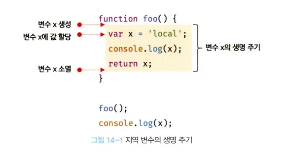

# 14.1 변수의 생명 주기

---

## 14.1.1 지역 변수의 생명주기

- 변수는 선언애 의해 생성, 할당을 통해 값을 갖는다.
- 변수는 생물과 유사하게 생성되고 소멸되는 생명주기가 있다.
- 변수에 생명주기가 없으면 선언된 변수는 프로그램을 종료하지 않는 한 메모리 공간을 영원히 점유한다.
- 변수는 자신이 선언된 위치에 생성되고 소멸한다.
- 애플리케이션의 생명주기와 같다.
- 함수 내부에 선언된 지역변수는 함수가 호출되고 생성되고 종료하면 소멸한다.

예제 14-1

```js
function add() {
  var x = "local";
  console.log(x); // local
  return x;
}

foo();
console.log(x); // ReferenceError x is not defined
```

- 지역 변수 x는 foo함수가 호출되기 이전까지 생성되지 않는다.
- foo 함수를 호출하지 않으면 내부의 변수 선언문이 실행되지 않는다.
- 변수 선언은 선언문이 어디에 있든 가장 먼저 실행된다.
- 런타임 이전 단계에서 자바스크립트 엔진에 의해 먼저 실행된다.
- 전역 변수에 한정된 설명이다. 함수 내부에 선언한 변수는 함수가 호출된 직후에 함수 몸체의 코드가 한 줄씩 순차적으로 실행 전 자바스크립트 엔진에 의해 먼저 실행된다.
- x변수의 선언문이 가장 먼저 실행되고 undefined로 초기화된다.
- 함수 몸체를 구성하는 문들이 순차적으로 실행되어 함수 할당문이 실행되고 x변수에 값이 할당된다.
- **지역 변수의 생명 주기는 함수의 생명 주기와 일치한다.**
  

- 함수 몸체 내부에 선언된 지역 변수의 생명 주기는 함수의 생명 주기와 대부분 일치하나 **지역 변수가 함수보다 오래 생존하는 경우도 있다**
- 변수는 하나의 값을 저장하기 위해 메모리 공간, 메모리 공간을 식별하기 위해 붙인 이름이다.
- 변수의 생명 주기는 메모리 공간이 해제되어 가용 메모리 풀에 반환되는 시점까지다.

- 함수 내부에 선언된 지역 변수는 함수가 생성한 스코프에 등록된다.
- 스코프는 렉시컬 환경이라 부른다.
- 변수는 자신이 등록된 스코프가 소멸될 때 까지 유효하다.
- 할당된 메모리 공간은 더이상 참조하지 않을 때 가비지 콜렉터에 의해 헤제되어 가용 메모리 풀에 반환된다.
- 메모리 공간을 참조하고 있으면 확보된 상태로 남는다.

예제 14-2

```js
var x = "global";

function foo() {
  console.log(x); // 1. undefined
  var x = "local";
}

foo();
console.log(x); // global
```

- foo 함수 내부에 선언된 지역 변수 x는 1 시점에 이미 선언 -> undefined로 초기화 되었다.
- 지역 변수 x를 참조해 값을 출력한다.
- 지역 변수는 함수 전체에 유효하다.
- 변수 할당문이 실행되기 이전에 undefined 값을 갖는다.

- **호이스팅은 스코프를 단위로 동작한다**
- 전역 변수의 호이 스팅은 변수의 선언이 전역 스코프의 선두로 끌어 올려진 것처럼 동작한다.
- 전역변수는 전역 전체에 유효하다.
- 지역 변수 호이스팅은 지역 변수 선언이 지역 스코프의 선두로 끌어 올려진 것처럼 동작한다.
- **호이스팅은 변수의 선언이 스코프의 선두로 끌어 올려진 것처럼 동작하는 자바스크립트 고유의 특징**을 말한다.

---

## 14.1.2 전역 변수의 생명주기

예제 13-3

```js
var x = "global";

function foo() {
  var x = "local";
  console.log(x); // 1
}

foo();

console.log(x); // 2
```

### 🔔 전역 객체

> **💡 참고**
>
> **전역 객체**는 코드가 실행되기 이전 단계에 자바스크립트 엔진에 의해 어떤 객체보다도 먼저 생성되는 특수한 객체입니다.
>
> - **클라이언트 사이드(브라우저):** `window`
> - **서버 사이드(Node.js):** `global`
>
> 환경에 따라 전역 객체를 가리키는 다양한 식별자(`window`, `self`, `this`, `frames`, `global`)가 존재했으나 **ES11**에서 **`globalThis`**로 통일되었습니다.
>
> 전역 객체는 표준 빌트인 객체(`Object`, `String`, `Number`, `Function`, `Array`…)와 환경에 따른 호스트 객체(Web API 또는 Node.js API), 그리고 `var` 키워드로 선언한 전역 변수와 전역 함수를 프로퍼티로 갖습니다.

---
