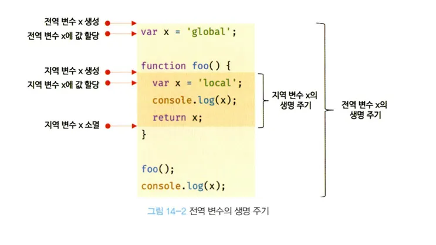

# 13.3 스코프 체인

- 스코프 체인은 자바스크립트에서 변수나 함수 식별자를 검색할 때 사용하는 계층적 구조다.
- 함수가 중첩되면 지역 스코프가 중첩되고 계층적인 구조를 형성, 모든 지역 스코프는 상위 스코프를 통해 전역 스코프와 연결된다.
- **변수를 참조 -> 자바스크립트 엔진은 스코프 체인을 통해 변수를 참조하는 코드의 스코프에 시작 -> 상위 스코프 방향으로 이동 후 선언된 변수를 검색한다.**
- **이를 통해 상위 스코프에서 선언한 변수를 하위 스코프에도 참조할 수 있다.**
- 모든 스코프가 계층적으로 연결된 구조를 스코프 체인이라 하고, 자바스크립트 엔진은 스코프 체인을 통해 변수를 검색한다.
  

- 자바스크립트의 스코프 체인 구조는 전역 스코프 -> 지역 스코프(outer) -> 지역 스코프(inner) 순으로 연결된다.

```js
var x = "global x";
var y = "global y";

function outer() {
  var z = "outer's local z";

  function inner() {
    var x = "inner's local x";
    console.log(x); // "inner's local x"
    console.log(y); // "global y"
    console.log(z); // "outer's local z"
  }

  inner();
}

outer();

console.log(z); // ReferenceError: z is not defined
```

---

> ## ⭐ 렉시컬 환경
>
> 💡
> 스코프 체인은 실행 컨텍스트의 렉시컬 환경을 단방향으로 연결한 것이다.
> 전역 렉시컬 환경은 코드가 로드되면 바로 생성되고 함수의 렉시컬 환경은 함수가 호출되면 곧바로 생성된다.

---

## 13.3.1 스코프 체인에 의한 변수 검색

1. x 변수 참조:

   - `inner`함수 지역 스코프에서 `x`변수를 검색한다.
   - `x`가 `inner`함수의 지역 스코프에 존재하므로 검색을 종료하고 값을 참조한다.

2. y 변수 참조:

   - `inner`함수 지역 스코프에서 `y`변수를 검색한다.
   - `y`가 존재하지 않아 상위 스코프인 전역 스코프로 이동하여 `y`변수를 검색한다.
   - 전역 스코프에서 `y` 변수가 선언되어 검색을 종료하고 값을 참조한다.

3. z 변수 참조:
   - `inner`함수 지역 스코프에서 z변수를 검색한다.

- 상위 스코프의 변수는 하위 스코프에서 참조할 수 있다.
- 하위 스코프의 변수는 상위 스코프에서 참조할 수 없다.
  - 변수 검색은 항상 상위 방향으로 이루어지고, 하위 스코프는 검색하지 않는다.

---

## 13.3.2. 스코프 체인에 의한 함수 검색

- foo 함수와 bar 함수 내부에서 정의된 foo 함수가 있다.
  예제 13-6

```js
// 전역 함수
function foo() {
  console.log("global function foo");
}

function bar() {
  // 중첩 함수
  function foo() {
    console.log("local function foo");
  }
  foo(); // 1
}

bar();
```

- 자바스크립트 엔진은 함수 이름과 동일한 이름의 식별자를 암묵적으로 선언, 생성된 함수 객체를 할당한다.
- 1에서 foo 함수를 호출, 자바스크립트 엔진은 함수를 호출하기 위해 함수를 가르키는 식별자 foo를 검색한다.
- 함수도 식별자에 해당되어 스코프를 갖는다.
- 함수는 함수 객체가 할당된 것외에 일반 변수와 다를 바 없다.
- 스코프를 식별자는 검색하는 규칙이라고 하는게 적합하다.
