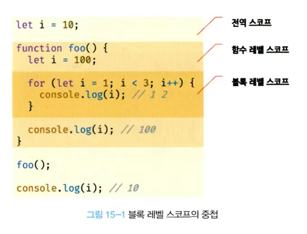
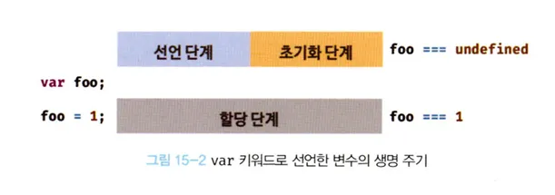
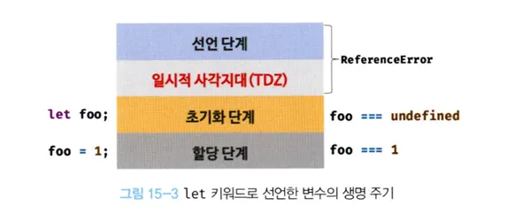
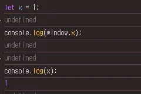

# 15.2 let 키워드

- var 키워드 단점을 보완하기 위해 ES6에서 새로 변수 선언 키워드인 let, const를 도입했다.

---

## 15.2.1 변수 중복 선언 금지

- var 키워드로 동일한 변수를 중복 선언하면 에러가 발생하지 않는다.
- 의도치 않게 먼저 선언된 변수의 값이 재할당되는 부작용이 발생한다.
- let 키워드로 이름이 같은 변수를 중복 선언하면 문법 에러가 발생한다.
  예제 15-5

```js
var foo = 123;
// var 키워드로 선언된 변수는 같은 스코프 내에서 중복 선언을 허용한다.
// 아래 변수 선언문은 자스 엔진에 의해 var 키워드가 없는 것처럼 동작한다.
var foo = 456;

let bar = 123;
// let, const 키워드로 선언한 변수는 같은 스코프 내에서 중복 선언을 허용하지 않는다.
let bar = 456; // SyntaxError 'bar' already been declared
```

---

## 15.2.2 블록 레벨 스코프

- var 키워드로 선언한 변수는 함수의 코드 블록만을 지역 스코프로 인정하는 함수 레벨 스코프를 따른다.
- let 키워드로 선언한 변수는 모든 코드 블록(함수, if 문, for 문, while 문, try/catch 문 등)을 지역스코프로 인정하는 블록 레벨 스코프를 따른다.
  예제 15-6

```js
let foo = 1; // 전역 변수

{
  let foo = 2; // 지역 변수
  let bar = 3; // 지역 변수
}

console.log(foo); // 1
console.log(bar); // ReferenceError: bar is not defined
```

- let 키워드로 선언된 변수는 블록 레벨 스코프를 따른다.
- foo변수와 bar변수는 지역 변수다.
- 전역에서 선언된 foo변수와 코드 블록 내에서 선언된 foo변수는 다른 별개의 변수다.
- bar 변수도 블록 레벨 스코프를 가진 지역 변수다.
- 전역에서 bar변수를 참조할 수 없다.

- 함수도 코드 블록으로 스코프를 만든다. 함수 내의 코드 블록은 함수 레벨 스코프에 중첩된다.
  

---

## 15.2.3 변수 호이스팅

- var 키워드로 선언한 변수와 달리 let 키워드로 선언한 변수는 변수 호이스팅이 발생하지 않는 것처럼 동작한다.
  예제 15-7

```js
console.log(foo); // ReferenceError: foo is not defined
let foo;
```

- 이처럼 let으로 선언한 변수를 변수 선언문 이전에 참조하면 참조 에러가 발생한다.
- var키워드는 런타임 이전에 엔진에 의해 암묵적으로 "선언 단계"와 "초기화 단계"가 한번에 진행된다.
- 선언 단계에서 스코프(실행 컨텍스트의 렉시컬 환경)에 변수 식별자를 등록해 자바스크립트 엔진의 변수의 존재를 알린다.
- 초기화 단계에서 ndefined로 변수를 초기화 한다.
- 선언문 이전에 접근해도 스코프에 변수가 존재하지 않아서 에러가 발생하지 않는다.
- 이후 변수 할당문에 도달하면 값이 할당된다.

에제 15-8

```js
// var 키워드로 선언한 변수는 런타임 이전에 선언 단계와 초기화 단계가 실행된다.
// 따라서 변수 선언문 이전에 변수를 참조할 수 있다.
console.log(foo); // undefined

var foo;
console.log(foo); // undefined

foo = 1; // 할당문에서 할당 단계 실행
console.log(foo); // 1
```



- **let 키워드로 선언한 변수는 "선언 단계"와 "초기화 단계"가 분리되어 진행된다.**
- 자바스크립트 엔진에 의해 암묵적으로 선언 단계가 먼저 실행, 초기화 단계는 변수 선언문에 도달했을 때 실행된다.

- 초기화 단계가 실행되기 이전 변수에 접근하면 참조에러가 발생한다.
- let 키워드로 선언한 변수는 스코프의 시작 지점부터 초기화 다계 시작 지점까지 변수를 참조할 수 없다.
- 스코프의 시작 지점부터 초기화 시작 지점까지 변수를 참조할 수 없는 구간을 일시적 사각지대(Temporal Dead Zone: TDZ)라 부른다.
  예제 15-9

```js
// 런타임 이전에 선언 단계가 실행된다. 변수가 초기화되지 않았다.
// 초기화 이전의 일시적 사각지대에서 변수를 참조할 수 없다.
console.log(foo); // ReferenceError: foo in not defined

let foo; // 변수 선언문에서 초기화 단계가 실행된다.
console.log(foo); // undefined

foo = 1; // 할당문에서 할당 단계가 실행된다.
console.log(foo); // 1
```



- let 키워드로 선언한 변수는 변수 호이스팅이 발생하지 않는 것처럼 보인다.
  예제 15-10

```js
let foo = 1; // 전역 변수
{
  console.log(foo); // ReferenceError: Cannot access 'foo' before initializtion
  let foo = 2; // 지역 변수
}
```

- let 키워드로 선언한 변수의 경우 호이스팅이 발생하지 않으면 위 예제는 전역변수 foo 값을 출력해야 한다.
- let 키워드로 선언한 변수도 호이스팅이 발생하여 참조에러가 발생한다.

- 자바스크립트는 ES6에서 도입된 let, const를 포함해 모든 선언(var, let, const, function, function\*, class)을 호이스팅 한다.
- let, const, class를 사용한 선언문은 호이스팅이 발생하지 않는 것처럼 동작한다.

---

## 15.2.4 전역 객체와 let

- var 키워드로 선언한 전역 변수, 전역함수, 선언하지 않은 변수에 값을 할당한 암묵적 전역은 객체 window의 프로퍼티가 된다.
- 전역 객체의 프로퍼티를 참조할때 window를 생략할 수 있다.

```js
// 이 예제는 브라우저 환경에서 해야한다.

// 전역 변수
var x = 1;
// 암묵적 전역
y = 2;
// 전역 함수
function foo() {
  // var 키워드로 선언한 전역 변수는 전역 객체 widnow의 프로퍼티다.
  console.log(window.x); // 1
  // 전역 객체 window의 프로퍼티는 전역 변수처럼 사용할 수 있다.
  conosle.log(x); // 1

  // 암묵적 전역은 전역 객체 widnow의 프로퍼티다.
  console.log(window.y); // 2
  console.log(y); // 2

  // 함수 선언문으로 정의한 전역 함수는 전역 객체 window의 프로퍼티다.
  console.log(window.foo); // f foo() {}
  // 전역 객체 window의 프로퍼티는 전역 변수처럼 사용할 수 있다.
  cosnole.log(foo); // f foo() {}
}
```


- let 키워드로 선언한 전역 변수는 전역 객체의 프로퍼티가 아니다.
- window, foo와 같이 접근할 수 없다.
- let 전역 변수는 보이지 않는 개념적인 블록(전역 렉시컬 환경의 선언적 환경 레코드)내에 존재하게 된다.

예제 15-20

```js
// 이 예제는 브라우저 환경에서 실행해야 한다.
let x = 1;

// let, const 키워드로 선언한 전역 변수는 전역 객체 window의 프로퍼티가 아니다.
console.log(window.x); // undefined
console.log(x); // 1
```



- 자바스크립트의 가장 큰 문제점 중 하나는 파일이 분리되어 있어도 하나의 전역 스코프를 공유한다는 것이다.
- 다른 파일 내에서 동일한 이름으로 명명된 전역 변수나 전역 함수가 같은 스코프 내에 존재할 경우 예상치 못한 결과를 가져 올 수 있다.
